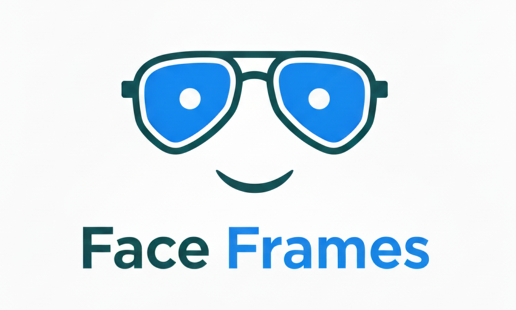

  
  <h1>Face-Frames</h1>

<table width="100%" border="0" cellspacing="0" cellpadding="0">
  <tr>
    <!-- LEFT: Descriptions -->
    <td width="65%" valign="top">
      <h2>Description</h2>
      
<strong>Facial analysis and intelligent eyewear recommendation.</strong>

      <blockquote>
        An application that detects face shapes using facial landmarks and biometric calculations
        to recommend the perfect frames.
      </blockquote>
      <h2>Descripción</h2>
      
<strong>Análisis facial y recomendación inteligente de lentes.</strong>

      <blockquote>
        Aplicación que detecta la forma del rostro mediante facial landmarks (puntos de referencia)
        y cálculos biométricos para recomendar el armazón ideal.
      </blockquote>
    </td>
    <!-- RIGHT: GIF -->
    <td width="35%" align="center" valign="middle">
      
    </td>
  </tr>
</table>

<h2>Tools and Technologies | Herramientas y Tecnologías</h2>
  <ul>
    <li><strong>Models:</strong> MediaPipe (Facial Landmarks)</li>
    <li><strong>Package Manager:</strong> PNPM</li>
    <li><strong>Frontend:</strong> JavaScript, React JS & Tailwind CSS</li>
    <li><strong>Tools:</strong> Docker, Git & GitHub</li>
    <li><strong>Deploy:</strong> Vercel</li>
  </ul>
  

    
  

  <h3>
    🔗 <a href="https://face-frames.vercel.app">Face-Frames App</a>
  </h3>
  
<code>v1.1.3</code>

